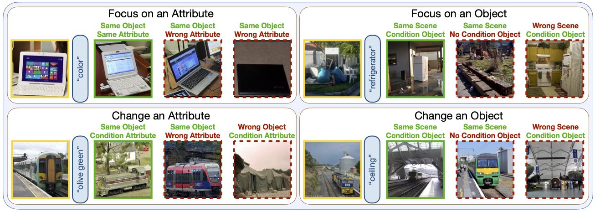

# GeneCIS: A Benchmark for General Conditional Image Similarity

GeneCIS (pronounced 'genesis') is a zero-shot evaluation benchmark for measuring models' ability to adapt to various notions of visual 'similarity' given different text prompts. This is also related to the 'Composed Image Retrieval' task.

This repo contains boiler plate evaluation code for the benchmark, as well as traning code for a model which tackles it by using image-caption data.

Find more details in our [paper](TODO).

<p align="center">  </p>

## Contents
[:computer: 1. Installation](#install)

[:arrow_down: 2. Downloads](#downloads)

[:notebook_with_decorative_cover: 3. Pre-processing before training](#preproc)

[:train: 4. Training](#training)

[:closed_book: 5. GeneCIS annotation format](#annots)

[:chart_with_upwards_trend: 6. Evaluation](#eval)

[:clipboard: 7. Citation](#cite)

## <a name="install"/> :computer: Installation

```bash
# Create virtual env 
conda create -n genecis python=3.9.12
conda activate genecis
conda install --yes -c pytorch pytorch=1.12.0 torchvision=0.13.0 cudatoolkit=11.3.1     # Change toolkit version if necessary
pip install git+https://github.com/openai/CLIP.git

# Under your working directory
git clone git@github.com:facebookresearch/genecis.git
cd genecis
pip install -r requirements.txt
python -m spacy download en         # Required for scene graph parsing
```
## <a name="downloads"/> :arrow_down: Downloads

Download instructions can be found [here](/DOWNLOAD.md). You will need to download raw images from the COCO 2017 validation split and VisualGenome1.2 to evaluate on GeneCIS.
You can also find instructions to download: parsed CC3M scene graphs; 1.6M mined triplets from CC3M; pre-trained model weights; and additional evaluation datasets.

## <a name="preproc"/> :notebook_with_decorative_cover: Pre-processing before training

We train models for GeneCIS using image-caption data from [Conceptual Captions 3M](https://ai.google.com/research/ConceptualCaptions/download). 
Before training the models, we need to [parse scene graphs](train/extract_scene_graphs.py) and [mine training triplets](train/create_deterministic_samples.py) from the raw data. 
You can process these yourself, or else download them directly following instructions [here](/DOWNLOAD.md). 

To process yourself, set hyper-parameters in ```config.py``` (or leave in the default setting), and look at the example commands in ```bash_scripts/mine_training_samples.sh```.
Especially, mining the training triplets can take a long time if done in series, but running the following command in parallel with SHARD_INDEX ranging from ```0``` to ```config.NUM_SHARDS - 1``` will speed up the process:
```
export PYTHONPATH=/path/to/project
python -m train.create_deterministic_samples --shard_index SHARD_INDEX
```

The mined triplets can then be combined into a single file with: 

```
export PYTHONPATH=/path/to/project
python -m train.combine_deterministic_samples
```

## <a name="training"/> :train: Training

Training the models with default hyper-parameters requires training on 16 GPUs. To do this with multi-node training, edit paths and run: 

```
bash_scripts/submitit_train_cc3m.sh
```

Otherwise, for single node training, an example command is given in:

```
bash_scripts/train_cc3m.sh
```

## <a name="annots"/> :closed_book: GeneCIS annotation format

All GeneCIS templates (for each of the four tasks) are provided as a list of ```dicts``` in JSON files in the ```genecis``` sub-directory. Each ```dict``` cotains keys for: reference image (image ID); target image (image ID); text condition (string); list of gallery images (image IDs).

* **Annotations for attribute-based tasks** further contain bounding boxes for the object instance in the template. This is then cropped, dilated and padded to square in the evaluation code. The image ID is specified as ```image_id``` and refers to the VisualGenome1.2 image ID.
* **Annotations for object-based tasks** have image ID specified as ```val_image_id```, referring to the image ID in the COCO 2017 validation set.


## <a name="eval"/> :chart_with_upwards_trend: Evaluation

Example evaluation code for GeneCIS (and related CIR datasets) is given in ```bash_scripts/evaluate_all_datasets.sh```.
Evaluation of the models [here](/DOWNLOAD.md) should re-create numbers from Table 2 (main paper) and Table 6 (Appendix).

When training models, we save the best model using the validation performance on [CIRR](https://github.com/Cuberick-Orion/CIRR). This model is then evaluated **zero-shot** on GeneCIS. As such, despite fixing seeds, we found some variance between runs. We found a standard deviation in ```Average Recall @ 1``` of **0.2%** across seeds and validation splits. 

Finally, we highlight that there is some **noise in GeneCIS**, coming from the underlying datasets which we build on.
We are currently in the process of cleaning the dataset through manual annotation and present the current version as 'GeneCIS v0'. 
Nonetheless, boosts greater than 0.2% in ```Average Recall @ 1``` can be considered significant.

## <a name="cite"/> :clipboard: Citation

If you use this code in your research, please consider citing our paper:
```
@article{vaze2023gen,
        title={GeneCIS: A Benchmark for General Conditional Image Similarity},
        author={Sagar Vaze and Nicolas Carion and Ishan Misra},
        journal={arXiv preprint},
        year={2023}
        }
```